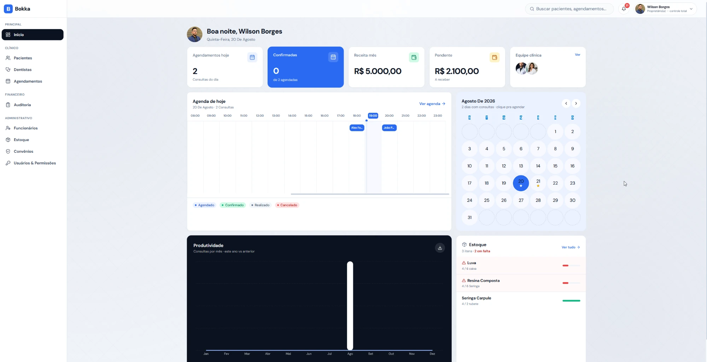
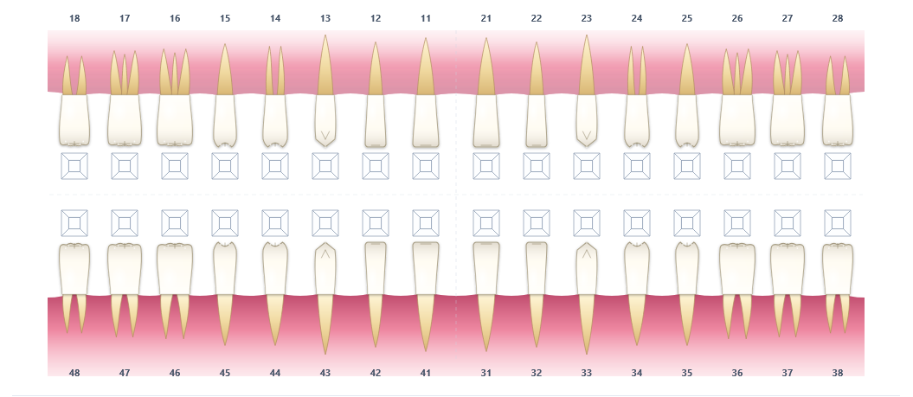
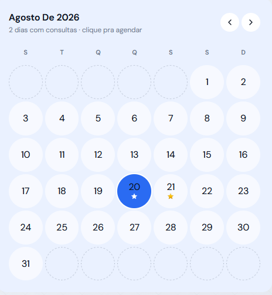
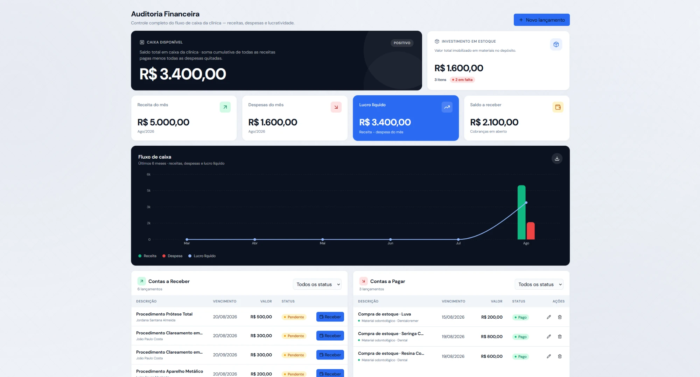
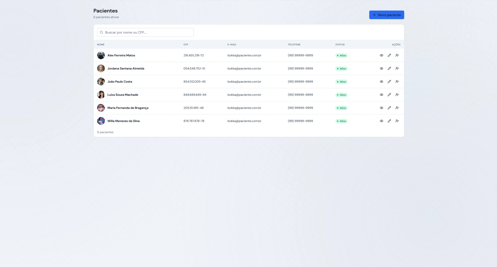
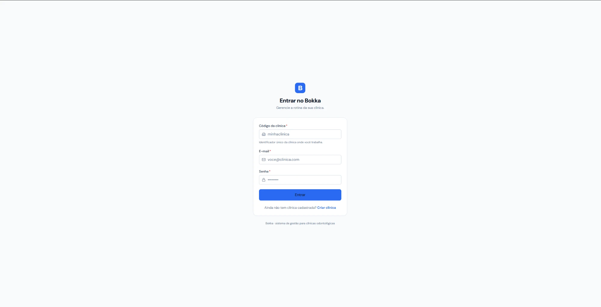

# Bokka Web

Frontend do Bokka, sistema de gestão para clínicas odontológicas.

A aplicação foi desenvolvida em React e TypeScript e consome a Bokka API para atender os fluxos clínicos, administrativos e financeiros do sistema.

- Aplicação: https://bokka.com.br
- Backend: https://github.com/wilsonborgesbr/odonto-clinic-api
- API: https://api.bokka.com.br

## Screenshots

O sistema exige autenticação, então as principais telas podem ser visualizadas abaixo sem necessidade de acesso a uma conta real.

| Dashboard | Odontograma | Agenda |
| --- | --- | --- |
|  |  |  |

| Financeiro | Pacientes | Login |
| --- | --- | --- |
|  |  |  |

## Stack

- React 19
- TypeScript 6
- Vite 8
- Tailwind CSS 4
- TanStack React Query 5
- React Router 7
- Recharts 3
- Axios
- Headless UI
- Lucide React

## O sistema

O frontend possui atualmente 33 páginas distribuídas pelos módulos da clínica.

Entre os principais recursos estão:

- dashboard com indicadores financeiros e operacionais
- agenda de atendimentos
- cadastro e consulta de pacientes
- gestão de dentistas e funcionários
- odontograma interativo
- anamnese
- procedimentos
- documentos clínicos
- estoque
- contas a pagar e receber
- auditoria financeira
- convênios
- usuários e permissões
- busca global
- notificações

## Odontograma

Um dos componentes específicos do sistema é o odontograma desenvolvido em SVG.

Ele representa os 32 dentes e permite trabalhar individualmente com as 5 faces de cada dente.

O componente foi criado para permitir interação direta com a representação visual, mantendo os dados integrados ao prontuário do paciente.

## Design system

O projeto utiliza um conjunto próprio de componentes reutilizáveis.

Atualmente são 18 componentes base, incluindo:

- Button
- Card
- Modal
- Badge
- Skeleton
- EmptyState
- Pagination
- Toast
- Avatar
- Field

Esses componentes são reutilizados nas diferentes páginas para manter comportamento e interface consistentes.

## Dados e API

A comunicação com o backend é feita com Axios.

O TanStack React Query cuida do cache, sincronização e atualização dos dados recebidos da API.

A aplicação consome o backend disponível em:

```text
https://api.bokka.com.br
```

No desenvolvimento local:

```text
http://localhost:8080
```

## Autenticação e permissões

A autenticação utiliza JWT emitido pelo backend.

O backend envia no token as informações necessárias para o controle de acesso.

O frontend utiliza essas permissões para:

- proteger rotas
- controlar itens da sidebar
- exibir ou ocultar ações
- adaptar a interface de acordo com o usuário autenticado

O sistema possui 8 roles e 14 permissões granulares.

A interface utiliza essas informações para experiência do usuário, enquanto a autorização definitiva continua sendo validada pela API.

## Executando localmente

Clone o projeto:

```bash
git clone https://github.com/wilsonborgesbr/odonto-clinic-web.git
cd odonto-clinic-web
```

Instale as dependências:

```bash
npm install
```

Crie o arquivo `.env`:

```env
VITE_API_URL=http://localhost:8080
```

Inicie o frontend:

```bash
npm run dev
```

A aplicação ficará disponível em:

```text
http://localhost:5173
```

O backend precisa estar rodando em `localhost:8080` para que os recursos que dependem da API funcionem normalmente.

## Scripts

Desenvolvimento:

```bash
npm run dev
```

Build de produção:

```bash
npm run build
```

Lint:

```bash
npm run lint
```

Preview do build:

```bash
npm run preview
```

## Estrutura

```text
src/
├── components/
├── contexts/
├── hooks/
├── pages/
├── services/
├── types/
└── utils/
```

- `components` contém o design system e componentes compartilhados.
- `contexts` concentra estados globais, como autenticação e notificações.
- `hooks` contém hooks reutilizáveis.
- `pages` reúne as páginas organizadas pelos módulos do sistema.
- `services` contém a comunicação HTTP com a API.
- `types` concentra as tipagens TypeScript.
- `utils` contém funções auxiliares.

## Deploy

O frontend está hospedado no Cloudflare Pages.

O branch `main` é utilizado para o deploy de produção.

Aplicação:

https://bokka.com.br

Backend:

https://api.bokka.com.br

Os dois projetos possuem repositórios e processos de deploy independentes.

## Autor

Wilson Borges

Estudante de Análise e Desenvolvimento de Sistemas.

- GitHub: https://github.com/wilsonborgesbr
- LinkedIn: https://linkedin.com/in/wilsonborgeslima
